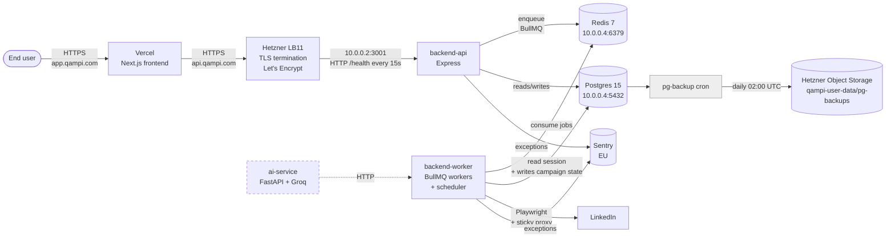
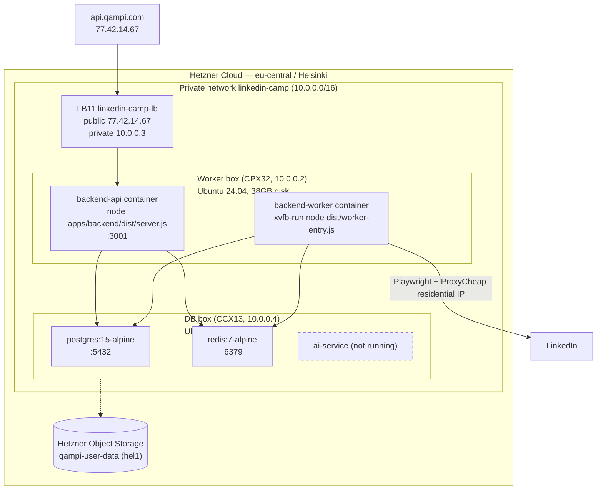

# Qampi — High Level Design

**One-line pitch:** Multi-tenant SaaS that runs personalized LinkedIn outreach campaigns on behalf of users, using their own LinkedIn session and a dedicated residential proxy per account.

**Last updated:** 2026-05-20.
**Status:** prod stack live on Hetzner Cloud (eu-central / Helsinki). DB-backed sessions, per-account Redis lock, single worker box, single DB box.

---

## 1. System context

`ai-service` exists in the compose file but is not yet running in prod — bring up when AI personalization is needed.

---

## 2. Components and responsibilities

| Component | Where it runs | Responsibilities |
|---|---|---|
| **Frontend** (`apps/web`) | Vercel | Auth UI, campaign builder, LinkedIn connection wizard, live activity feed (Socket.IO) |
| **Marketing site** (`apps/landing`) | Vercel | Public-facing site (qampi.com) |
| **backend-api** (`apps/backend`, entry `dist/server.js`) | Worker box 10.0.0.2 | HTTP API, auth, campaign CRUD, LinkedIn login orchestration via `session-manager.service.ts`, Socket.IO server, enqueues BullMQ jobs |
| **backend-worker** (`apps/backend`, entry `dist/worker-entry.js`) | Worker box 10.0.0.2 | BullMQ consumers (campaign-actions, linkedin-actions, inbox-sync, proxy-health), cron scheduler that scans active campaigns every minute, drives Playwright. Same Docker image as backend-api, different command |
| **Postgres** | DB box 10.0.0.4 | Source of truth for users, campaigns, leads, **LinkedIn sessions** (cookies/localStorage/fingerprint stored in `User` row) |
| **Redis** | DB box 10.0.0.4 | BullMQ queues + per-account distributed locks (`linkedin-lock:${userId}` SETNX EX 600) + user presence |
| **ai-service** (`apps/ai-service`) | DB box 10.0.0.4 (planned) | Groq LLM proxy for AI-personalized messages |
| **Hetzner LB11** | eu-central | TLS termination for `api.qampi.com`, Let's Encrypt managed cert, HTTP health check on `/health`, HTTP→HTTPS 301 redirect |

---

## 3. Deployment topology

**Firewall layers (defense in depth):**
1. Hetzner Cloud Firewall (`qampi-worker-fw`, `qampi-db-fw`) — network-level; only LB private IP can reach worker:3001, DB ports never exposed publicly.
2. ufw inside each VM — second-layer, allows SSH:22 and `10.0.0.0/16` only.

---

## 4. Tech stack

| Layer | Choice | Why |
|---|---|---|
| Runtime | Node.js 20 | Mature Playwright + Prisma ecosystem |
| Web framework | Express | Simple, debuggable |
| ORM | Prisma 6 | Generated types, clean migrations |
| Queue | BullMQ on Redis | Reliable, retries built in, lock primitives via Lua scripting |
| Browser automation | Playwright + `puppeteer-extra-plugin-stealth` | Better stealth than vanilla |
| DB | Postgres 15 | Standard, durable |
| Cache + locks | Redis 7 | Same instance backs BullMQ and `linkedin-lock:${userId}` SETNX |
| Frontend | Next.js 16 + React 19 | Vercel-native |
| Build | tsup (backend), Next.js (frontend) | Bundles backend into `dist/server.js` and `dist/worker-entry.js` from one entry config |
| Errors | Sentry (EU, free tier) | Captures every uncaught exception with stack |
| Backups | rclone + cron on db box | One binary, S3-compatible, idiomatic for Hetzner Object Storage |

---

## 5. Key design decisions

| Decision | Rationale |
|---|---|
| **DB-backed sessions** (cookies/localStorage/fingerprint on `User` row, not disk) | Workers become stateless — scale horizontally by adding container replicas without sharing a volume |
| **One LinkedIn account per Redis lock** | Two workers driving the same `li_at` from two IPs simultaneously is the #1 reason LinkedIn-automation SaaS gets accounts banned. SETNX EX 600 self-recovers if a worker crashes mid-campaign |
| **Sticky proxy per account** (`getOrAssignProxy(userId)`) | LinkedIn correlates account ↔ exit IP. Login on proxy A then campaign on proxy B looks like account hijacking and triggers checkpoints |
| **Two-server split** (api+worker on worker box, postgres+redis on db box) | Playwright is RAM-hungry and uncoordinated with DB workload. Co-locating both fights for OS cache. Splitting keeps the DB box predictable |
| **One Docker image, two entry commands** (`server.js` vs `worker-entry.js`) | Single build pipeline, single image registry artifact, but API and workers can be scaled independently |
| **HTTP API for login, Socket.IO only for status updates** | Initial socket-based login flow had a wiring bug (`session-handler.ts` was never registered). HTTP makes the request/response loop obvious and debuggable; Socket.IO is for one-way status streaming only |
| **No PgBouncer yet** | Prisma's built-in pool handles a single backend-api fine. Add PgBouncer only when multiple API replicas come online |
| **No object storage for sessions** | Session JSON is ~15KB per user. DB writes are transactional with the user row. Object storage is reserved for backups + debug artifacts |

---

## 6. Out of scope / not yet built

- Horizontal scaling of workers (lock primitives are ready; need to spin up a second worker container and load-test the contention path).
- AI personalization via `ai-service` (container exists but not yet brought up in prod).
- SSH hardening (root + password auth currently allowed; firewall restricts inbound but bots scan constantly).
- Rate limiting on `/api/v1/auth/*` (`express-rate-limit` would be ~5 min).
- CORS lockdown to `https://app.qampi.com` (currently allows `*`).
- Prisma indexes on hot paths (Campaign.status, CampaignLead composite, User.updatedAt).
- UptimeRobot external probe.
- CI/CD via GitHub Actions → GHCR → SSH deploy.

---

## 7. Operational quick reference

| Need | How |
|---|---|
| SSH to worker box | `ssh deploy@204.168.167.198` |
| SSH to db box | `ssh deploy@89.167.123.143` |
| Tail backend-api logs | `ssh deploy@204.168.167.198 'docker logs -f backend-api'` |
| Tail backend-worker logs | `ssh deploy@204.168.167.198 'docker logs -f backend-worker'` |
| psql shell | `ssh deploy@89.167.123.143 'docker exec -it postgres psql -U shiva -d linkedin_camp'` |
| Force a backup now | `ssh root@89.167.123.143 '/usr/local/bin/qampi-pg-backup.sh'` |
| Public health check | `curl https://api.qampi.com/health` |
| Hetzner console | https://console.hetzner.cloud |
| Sentry dashboard | qampi.sentry.io |
| Vercel project | app.qampi.com / qampi.com |

See `LLD.md` for module-level detail, sequence diagrams, env var reference, and runbooks.
